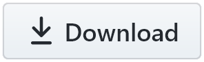

<h1 align="center"> GoatBots Card Watcher 
</h1>

Automatically refresh a [GoatBots](https://www.goatbots.com/) page on a set timer, check if any of the cards specified by name in the settings are in stock, and if so, add them to the cart, go to the delivery page, and alert the user. This is mainly useful if you're trying to buy new cards that are extremely rare and in high demand. Other players may beat you to the punch if you just manually check every few minutes. That's what motivated me to write this script. I was trying to buy the full-art promos from Double Masters 2022 and other people kept beating me to the draw. So, I made a script to watch the stock for me and give me a head start when a rare card comes into stock.

Configure the script by adding a pathname for a GoatBots page you want to scan, such as `https://www.goatbots.com/set/kaldheim`. When you navigate to that page, the script will automatically reload it on a timer to check if any cards on your list is in stock. When a card on your list is detected, an audio alert will play. You can scan as many pages as you want, and you can scan for as many cards per-page as you want. Each page has its own cards list in the config settings, so they won't get mixed up.

The alert will play synthesized speech of the names of the new cards, as long as at least one text-to-speech voice is available in your computer operating system. Otherwise it will just play a predefined sound file that says "New cards in stock." The sounds in this script are encoded directly in the script, so it doesn't download anything.

If you want to still be able to use the normal GoatBots page without it constantly reloading, add a `+` at the end of the URL: `https://www.goatbots.com/set/kaldheim+` for example. You can navigate to this kind of URL just fine, and your script manager will recognize it as a different URL. That way, the script will only activate when you explicitly navigate to the version of the URL with a + at the end. Just bookmark the version with a + at the end, and otherwise you can use GoatBots normally.

Then, replace the card names in the script's config section with the card names you want to scan for. Names must match the names on GoatBots precisely. By default, this will refresh the page every 10 seconds, provided the tab the page is loaded in is not active. It basically pauses refreshing while the tab is active, so that you can still use the page as normal. That way, it will only scan in the background, and alert you when it finds something. However, this pausing behavior can be disabled by setting `Refresh while active` to true in the config settings.

If you're using Firefox and you want the text-to-speech alerts, make sure the pref `media.webspeech.synth.enabled` is enabled in about:config. If you don't want or can't use text-to-speech, and the default sound file is not to your liking, you can replace it with your own base64-encoded audio file. You can convert any mp3 file to base64 by uploading it to [this encoder](https://codepen.io/xewl/pen/NjyRJx). Then just copy the resulting string and replace the `Voice audio file` value in the config settings with your new string. The script will decode and play it at runtime.

Before the synthesized speech or voice audio plays, the script will also trigger a little alert sound. This is done so that the alert will be more noticeable in the event that you're listening to dialogue when the alert goes off. The synthesized speech may not be as noticeable if there are other voices playing in the background, so I added a little "ding" noise to play at the same time. It's the same sound that plays when you get a notification in MTGO. This sound can also be changed. Again, it's a base64-encoded audio file, so use the same encoder as above.
